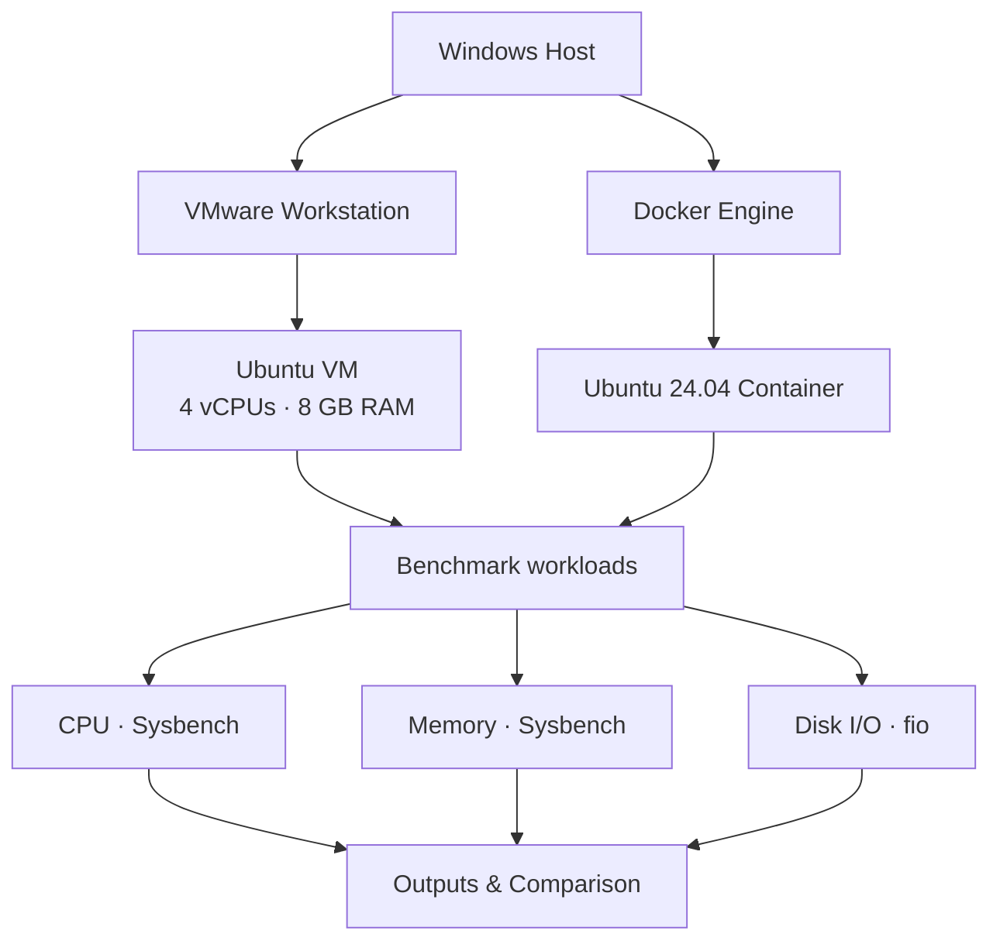
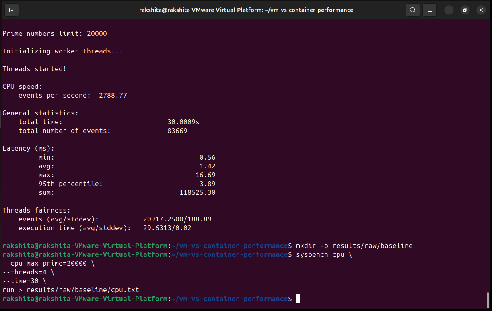
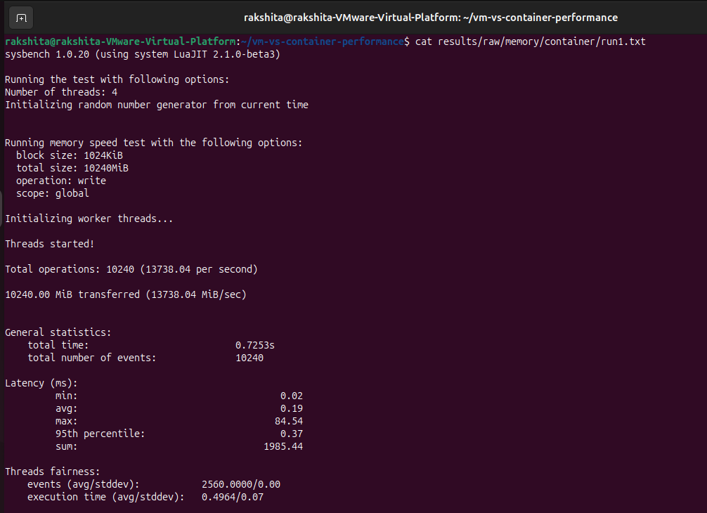

<div align="center">

# VM vs Container Performance Lab

### Three workloads. Two execution environments. One reproducible comparison.

A hands-on study of **CPU**, **memory**, and **disk I/O** performance using an Ubuntu virtual machine and Docker.

   

[Overview](#experiment-summary) · [Experiments](#experiments-performed) · [Results](#results-comparison) · [Setup](#tools--environment) · [Repository](#repository-map)

</div>

---

## Experiment Summary

This lab investigates how selected system workloads behave in two environments: an **Ubuntu VM running on VMware Workstation** and an **Ubuntu Docker container**. The performed work covers the first three sub-experiments in the lab manual: CPU benchmarking with Sysbench, memory benchmarking with Sysbench, and storage benchmarking with fio.

Benchmark output files, environment records, screenshots, and the CPU sweep script are kept in the repository. The results below are calculated directly from those saved outputs. They describe this machine and these runs; they should not be treated as universal performance rankings.

## Objectives

- Compare the recorded CPU, memory, and disk workload measurements from VM and container runs where matching outputs are available.
- Observe CPU throughput as the Sysbench thread count changes.
- Measure memory transfer rate using a fixed block size, workload size, and thread count.
- Examine sequential and random disk reads and writes using a consistent fio test profile.
- Preserve raw output and machine configuration so the measurements can be checked later.

## Architecture



The diagram shows the two benchmark environments and the tools used for each workload. The comparison uses the output saved for each experiment; where both environments have matching data, their recorded metrics are shown side by side.

## Experiments Performed

### Experiment 1 — CPU Performance

**Purpose.** Observe Sysbench CPU throughput under a prime-number calculation workload, including how the recorded sweep changes with thread count.

**What was run.** The benchmark uses a prime limit of `20,000` and a 30-second duration. The repository includes results for 1, 2, 4, and 8 threads, a baseline four-thread run, and one VM four-thread run.

**Recorded results.** The thread sweep ranges from **1,628.08 events/s** at one thread to **3,140.49 events/s** at four threads; the eight-thread capture reports **2,859.03 events/s**. The saved baseline reports **3,183.52 events/s**, while the VM run reports **3,259.69 events/s** at four threads. Those two four-thread records are close, but this repository does not contain a matching container CPU run, so they do not establish a VM-versus-container CPU result.



### Experiment 2 — Memory Performance

**Purpose.** Measure memory transfer throughput and latency with Sysbench using the same workload parameters in the VM and container.

**What was run.** Each run transfers 10 GiB using 1 MiB blocks and four threads. Ten output files are available for each environment.

**Recorded results.** The VM results average **39,810.17 MiB/s** across ten runs, with a range of **28,584.55–46,354.49 MiB/s**. The container results average **17,677.29 MiB/s**, ranging from **13,738.04–22,359.77 MiB/s**. In this set of runs, the VM mean is about **2.25×** the container mean. Individual run files retain the latency and other Sysbench statistics.



### Experiment 3 — Disk I/O Performance

**Purpose.** Compare storage throughput and I/O operations for sequential and random access patterns.

**What was run.** fio tests use a 2 GiB test file and a 30-second time-based run. Sequential operations use 1 MiB blocks; random operations use 4 KiB blocks. The repository contains a VM and a container output for each of the four workloads.

**Recorded results.** Container captures show higher bandwidth for sequential reads and both random workloads; the VM capture is higher for sequential writes. For example, sequential read bandwidth is **1,602 MiB/s** in the container output and **1,568 MiB/s** in the VM output. These are single captured outputs per workload, so treat them as observations rather than repeat-run averages.

| fio workload | VM bandwidth | Container bandwidth | Higher recorded value |
|---|---:|---:|---|
| Sequential read | 1,568 MiB/s | 1,602 MiB/s | Container |
| Sequential write | 1,515 MiB/s | 1,433 MiB/s | VM |
| Random read | 29.8 MiB/s | 36.2 MiB/s | Container |
| Random write | 32.1 MiB/s | 35.1 MiB/s | Container |

## Results Comparison

| Experiment / metric | VM | Container | Comparison note |
|---|---:|---:|---|
| CPU — four-thread baseline/run | 3,183.52 / 3,259.69 events/s* | No matching result in repository | Baseline and VM captures are close; not a paired environment comparison |
| Memory — mean throughput, 10 runs | 39,810.17 MiB/s | 17,677.29 MiB/s | VM mean is about 2.25× container mean |
| Disk — sequential read | 1,568 MiB/s | 1,602 MiB/s | Container higher in the saved capture |
| Disk — sequential write | 1,515 MiB/s | 1,433 MiB/s | VM higher in the saved capture |
| Disk — random read | 29.8 MiB/s | 36.2 MiB/s | Container higher in the saved capture |
| Disk — random write | 32.1 MiB/s | 35.1 MiB/s | Container higher in the saved capture |

\* CPU figures are the separate baseline and VM records in the repository. There is no corresponding container CPU result. Disk values are single captured runs; memory figures are arithmetic means from ten outputs per environment.

## Graphs

The figure below visualizes the CPU thread sweep, ten-run average memory throughput, and VM/container fio bandwidth captures. CPU and disk panels show the saved observations; the memory panel uses the mean of ten runs per environment.


## Tools & Environment

| Tool / component | Role in this lab |
|---|---|
| VMware Workstation | Hosts the Ubuntu virtual machine |
| Docker | Runs the Ubuntu benchmark container |
| Sysbench | CPU and memory workloads |
| fio | Sequential and random disk workloads |
| Bash | Runs the CPU thread-sweep script |

| Environment detail | Recorded configuration |
|---|---|
| Host operating system | Windows |
| VM guest operating system | Ubuntu |
| VM allocation | **4 vCPUs**, 8 GB RAM, 40 GB virtual disk |
| VM network | NAT |
| Container base image | Ubuntu 24.04 |

Configuration evidence is stored in `docs/`. The container Dockerfile is in `docker/Dockerfile`.

## Run the CPU Thread Sweep

From the repository root in a Linux environment with Sysbench installed:

```bash
bash scripts/run_cpu.sh
```

The script runs the CPU workload with 1, 2, 4, and 8 threads for 30 seconds per setting and saves output under `results/raw/cpu/`.

Build the benchmark image with Docker:

```bash
docker build -t vm-container-benchmark -f docker/Dockerfile .
```

The Dockerfile installs Ubuntu 24.04-based benchmark dependencies, including Sysbench and fio. For a controlled comparison, record the actual runtime resource limits and execution configuration alongside each run; Docker supports CPU and memory limits through runtime options such as `--cpus` and `--memory` ([Docker resource constraints](https://docs.docker.com/engine/containers/resource_constraints)).

## Tools and References

- [Sysbench project documentation](https://github.com/akopytov/sysbench) — built-in CPU and memory benchmarks.
- [fio documentation](https://fio.readthedocs.io/en/latest/fio_doc.html) — I/O workload options and reported metrics.
- [Docker resource constraints](https://docs.docker.com/engine/containers/resource_constraints) — CPU and memory controls for containers.

## Repository Map

```text
.
├── docker/
│   └── Dockerfile                  # Ubuntu benchmark image definition
├── docs/                           # VM and host configuration records
│   ├── cpu-info.txt
│   ├── kernel-info.txt
│   ├── memory-info.txt
│   ├── storage-info.txt
│   └── vm-configuration.txt
├── results/
│   ├── figures/
│   │   └── benchmark-summary.svg   # README comparison graphic
│   └── raw/
│       ├── baseline/               # Baseline CPU output
│       ├── cpu/                    # Thread sweep and VM CPU output
│       ├── disk/                   # fio results for VM and container
│       └── memory/                 # Sysbench results for VM and container
├── scripts/
│   └── run_cpu.sh                  # CPU thread-sweep runner
└── screenshots/                    # Terminal captures from the lab
```

## Conclusion

Across the saved memory runs, the VM recorded higher average Sysbench transfer throughput than the container. The fio captures are mixed: the container leads in sequential reads and both random workloads, while the VM leads in sequential writes. The CPU outputs show a useful thread sweep and a VM sample, but lack a matching container run for a direct CPU comparison.

Taken together, the measurements show why performance conclusions depend on the workload and the test setup. Repeated measurements, consistent resource allocation, and complete paired results make the comparison stronger. All reported values here come from the raw files included in this repository.
